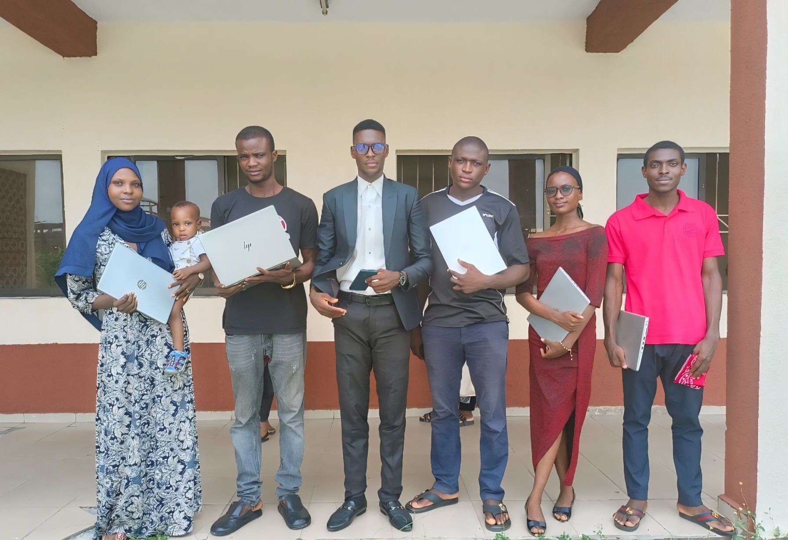

  

<!-- Banner -->

---

### 🌍 Inspiring a Safe and Secure Digital World  

**Cybersecurity Analyst & Educator** skilled in:  
☑️ Cloud & Network Security  
☑️ Threat Intelligence & Risk Management  
☑️ GRC & Cybersecurity Education  

---

## 👨‍💻 About Me
I am **Clifford Edewor**, a Cybersecurity Analyst and Educator dedicated to **securing systems and empowering people** through hands-on training, research, and leadership.

I have **trained and mentored 500+ learners** across institutions and national programmes, including serving as **Cybersecurity Instructor & Facilitator for Nigeria’s 3MTT Programme (NITDA)**. My work spans **infrastructure protection, risk management, and digital safety initiatives**, with measurable outcomes such as **reducing cyber risk exposure by 30–40% among learners and professionals**.

As the **HND Pioneer President of NACOS PTI Chapter**, I advanced student leadership in cybersecurity, AI, and cloud computing, fostering innovation and professional growth. 

I currently serve as an **IT Security Operations Officer through Sinic Engineering Limited, contractor to Segilola Resources Operating Limited (a subsidiary of Thor Explorations Ltd)**, where I oversee control room systems, networked security infrastructure, and secure operations within a safety-critical mining environment.

---

## 🛠️ Skills & Tools
- **Security:** Snort IDS, Firewalls, VPNs, SIEM tools  
- **Cloud & Networks:** Cisco Networking, Cloud Security, Wireshark  
- **Programming & Scripting:** Python, C++, Bash  
- **Governance & Risk:** ISO 27001, NIST Cybersecurity Framework  
- **Education & Training:** Cybersecurity Instructor & Facilitator 

---

## 📂 Featured Projects

### 🔹 [Snort IDS Threat Detection](https://github.com/CliffordEdewor/Snort-IDS-Threat-Detection)
Real-time threat detection and mitigation using Snort IDS, showcasing intrusion prevention and alerting techniques.  

### 🔹 [IoT Security: Mitigating Cybersecurity Threats in Connected Devices](https://github.com/CliffordEdewor/IoT-Security-Mitigating-Cybersecurity-Threats-in-Connected-Devices)
Mitigating cybersecurity threats in IoT devices through device-level, network-level, and data security approaches.  

### 🔹 [Online Voting System](https://github.com/CliffordEdewor/Online-Voting-System)
A web-based remote voting platform developed as part of ND final-year project to reduce electoral malpractice.  

---

## 📊 Highlights 

- **Trained and mentored over 500 learners** in cybersecurity across PTI, GMA, and NITDA’s 3MTT programmes through hands-on labs, awareness initiatives, and practical defense exercises.  

- **Served as Cybersecurity Coordinator and Incident Response Team Member** during **Nigeria’s 2023 General Elections**, contributing to secure electoral processes.  

- **Served as Cybersecurity Instructor and Facilitator** for **NITDA’s 3MTT Programme**, delivering hands-on practicals that complemented the **Google Cybersecurity Certificate**. **20% of trainees earned additional recognition**, including global certifications, laptop awards, and LinkedIn scholarships.  

- **Mentored and supervised ND2 cybersecurity and networking projects** at GMA, fostering innovation and real-world problem-solving.  

- **Prepared and defended the GMA Networking Lab** during **NBTE’s resource inspection** for the proposed **HND Networking & Cloud Computing programme**, leading to its official approval.  

- **Led cybersecurity awareness initiatives** that **reduced risk exposure by 30–40%** among students and staff.  

- **Served as HND Pioneer President, NACOS PTI Chapter**, establishing HND-level student leadership and advancing engagement in cybersecurity, AI, and cloud computing.  

- Trained and mentored over 500 learners in cybersecurity across PTI, GMA, and NITDA’s 3MTT programmes through hands-on labs, awareness initiatives, and practical defense exercises.
- Served as Cybersecurity Coordinator and Incident Response Team Member during Nigeria’s 2023 General Elections.
- Served as Cybersecurity Instructor and Facilitator for NITDA’s 3MTT Programme, delivering hands-on practicals that complemented the Google Cybersecurity Certificate. 20% of trainees earned additional recognition, including global certifications, laptop awards, and LinkedIn scholarships.
- Mentored and supervised ND2 cybersecurity and networking projects at GMA, fostering innovation and real-world problem-solving.
- Prepared and defended the GMA Networking Lab during NBTE’s resource inspection for the proposed HND Networking & Cloud Computing programme, leading to its official approval.
- Led cybersecurity awareness initiatives that reduced risk exposure by 30–40% among students and staff.
- Served as **HND Pioneer President, NACOS PTI Chapter**, establishing HND-level student leadership and advancing engagement in cybersecurity, AI, and cloud computing.

---

## 📸 Leadership in Action  

Beyond technical contributions, my leadership has created impact at institutional and national levels.  

  
    
     
  <em>Elected as HND Pioneer President, NACOS PTI Chapter, launching student leadership and engagement in computing and cybersecurity.</em>  

  

  
    
     
  <em>Representing PTI at NACOS National Convention, fostering collaboration and innovation among student leaders.</em>  

  

  
    
     
  <em>Facilitator, NITDA 3MTT Programme, delivering hands-on cybersecurity training to bridge theory and practice.</em>  

  

  
    
     
  <em>Celebrating 3MTT trainees who won national laptop awards, proof of mentorship impact and applied training outcomes.</em>  

  

---

## 🎓 Specialized Training & Certificates  

To strengthen my technical expertise and leadership capacity, I have completed specialized training from globally recognized institutions:  

- **ISC² Certified in Cybersecurity (CC)**, Course Completion  
- **EC-Council Applied Live Forensics**  
- **ISACA Cybersecurity Leadership & Management**, Certificate of Completion  
- **ISACA Cybersecurity Senior Management & Information Security Governance**, Certificate of Completion  
- **CS50 Introduction to Cybersecurity, HarvardX**  
- **Advanced Cybersecurity Program, Stanford University School of Engineering**  

---

## 📫 Connect With Me
- **Email:** edeworclifford@gmail.com  
- **LinkedIn:** [Clifford Edewor](https://www.linkedin.com/in/cliffordedewor)  
- **Twitter/X:** [@CliffordEdewor](https://x.com/CliffordEdewor)  

---

🛡️ *“Cybersecurity is not just about technology, it’s about people, trust, and resilience.”*  
