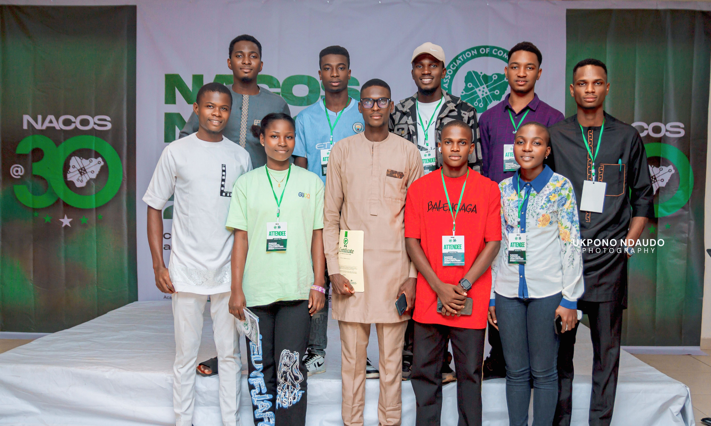

<!-- Cybersecurity Portfolio README -->

  

<h1 align="center">Clifford Edewor | Cybersecurity Portfolio</h1>

  <strong>Cybersecurity Specialist & Educator</strong> focused on IT/OT, Cloud, and Network Security.

  
  
  

---

<h2 align="center">Building Secure, Resilient Digital Systems</h2>

---

### 🧭 About Me  

**Cybersecurity Specialist and Educator** focused on securing systems and building practical cybersecurity capacity.

I work across IT/OT security, infrastructure protection, risk management, and incident response, with experience in regulated and safety-critical environments. I have trained and mentored **400+ learners** across institutions and national programmes, including serving as a **Cybersecurity Instructor and Facilitator under NITDA’s 3 Million Technical Talent (3MTT) Programme**, delivering hands-on, applied cybersecurity training.

My work has contributed to measurable risk reduction, including up to a **40% decrease in cyber-risk exposure** through improved security awareness, monitoring, and control deployment across IT and OT systems.

I currently serve as an **IT/OT Security Operations Officer** with **Sinic Engineering Limited**, deployed to **Segilola Resources Operating Limited (SROL)**, a subsidiary of **Thor Explorations Ltd**. In this role, I support the security of control-room systems, industrial networks, and enterprise infrastructure, implementing cybersecurity controls to maintain safe, resilient, and compliant operations in a safety-critical mining environment.

---

### 🛠️ Skills & Tools

#### 🧩 Security & Monitoring

#### ☁️ Cloud & Networks

#### 💻 Programming & Scripting

#### 🧱 Governance, Risk & Compliance

#### 🎓 Education & Training

---

### 📂 Featured Projects

### 🔹 [Snort IDS Threat Detection](https://github.com/CliffordEdewor/Snort-IDS-Threat-Detection)
Real-time threat detection and mitigation using Snort IDS, showcasing intrusion prevention and alerting techniques.  

### 🔹 [IoT Security: Mitigating Cybersecurity Threats in Connected Devices](https://github.com/CliffordEdewor/IoT-Security-Mitigating-Cybersecurity-Threats-in-Connected-Devices)
Mitigating cybersecurity threats in IoT devices, implementing device-level, network-level, and data security strategies to protect IoT ecosystems.

### 🔹 [Online Voting System](https://github.com/CliffordEdewor/Online-Voting-System)
A web-based remote voting platform developed as an ND final-year project to reduce electoral malpractice and enhance trust in online elections.

### 🔹 [Network Traffic Security Analysis](https://github.com/CliffordEdewor/Network-traffic-security-analysis)
A Cisco Packet Tracer project demonstrating how hubs broadcast all traffic and how switches intelligently forward frames to improve security and prevent sniffing.

---

### 📊 Highlights & Achievements

- Trained and mentored **400+ learners** across **PTI**, **GMA**, and the [National Information Technology Development Agency](https://nitda.gov.ng) **3MTT cybersecurity programme** through practical labs, awareness campaigns, and hands-on defence exercises.

- Served within **Nigeria’s 2023 General Election Cybersecurity Situation Room**, supporting system monitoring and coordinated incident response to protect election integrity.

- Delivered hands-on **cybersecurity training** under **NITDA’s 3MTT Programme**, enabling approximately **20% of participants** to achieve internationally recognised industry certifications **(ISC2 CC, CompTIA Security+)**, with others progressing into entry-level roles and receiving national recognition.

- Supervised **ND2 cybersecurity and networking projects** at [Global Maritime Academy](https://gma.edu.ng) **GMA**, strengthening practical problem-solving and applied security skills.
  
- Led **cybersecurity awareness and risk-reduction initiatives** that improved secure practices and reduced cyber risk exposure among students and staff by **40%**.

- Led the preparation and technical defence of the Networking Laboratory that secured [National Board for Technical Education](https://web.nbte.gov.ng/) approval for **GMA’s first HND Networking & Cloud Computing** programme.

- Served as the **Inaugural HND President** of the [Nigeria Association of Computing Students (NACOS)](https://nacos.org.ng/) PTI Chapter, establishing governance structures and coordinating student-led initiatives in cybersecurity, cloud computing, and emerging technologies.

---

### 📸 Leadership in Action

**My leadership journey spans institutional, national, and professional levels, shaping talent, innovation, and digital resilience.**

#### 🧑‍💼 Student & Institutional Leadership

  
 
<em>Served as HND Pioneer President, NACOS PTI Chapter, advancing student leadership in computing and cybersecurity.</em>

  

  

### 🧠 Cybersecurity Education & National Impact  

  
  
  
<em>Facilitated cybersecurity training under NITDA’s 3MTT Programme. Mentored trainees who earned national recognition, certifications, and laptop awards.</em>  

### 🏫 Institutional Development & Mentorship  

  
  
   
<em>Contributed to practical instruction and mentorship at GMA, guiding learners in cybersecurity, networking, and safety-critical digital systems.</em>

---

### 🎓 Specialized Training & Certifications

| Certification | Issuer |
|----------------|--------|
| **ISC² Certified in Cybersecurity (CC)**  | ISC² |
| **Applied Live Forensics** | EC-Council |
| **Cybersecurity Leadership & Management**  | ISACA |
| **Senior Management & Information Security Governance**  | ISACA |
| **CS50 Introduction to Cybersecurity** | HarvardX |
| **Advanced Cybersecurity Program** | Stanford University, School of Engineering |

---

### 🏛️ Professional Memberships
- Professional Member, Cyber Security Experts Association of Nigeria (CSEAN)
- Student Member, Nigeria Computer Society (NCS)

---

### 📫 Connect With Me

---

### 💬 Quote

> 🛡️ *“Cybersecurity is not just about technology, it’s about people, trust, and resilience.”*

---

  <i>© 2025 Clifford Edewor – Building Secure, Resilient Digital Systems</i>

