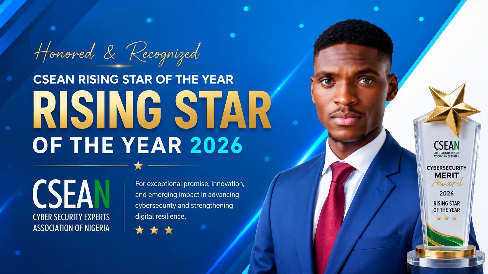
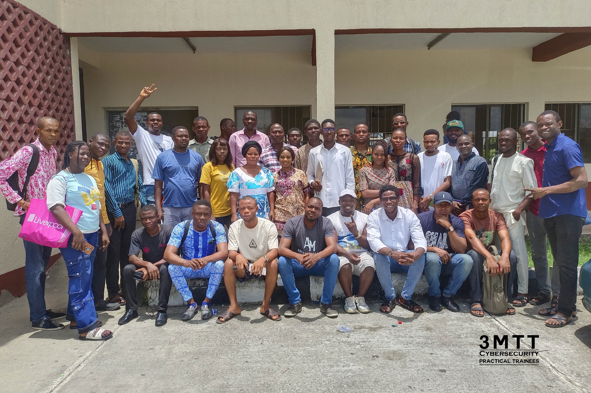
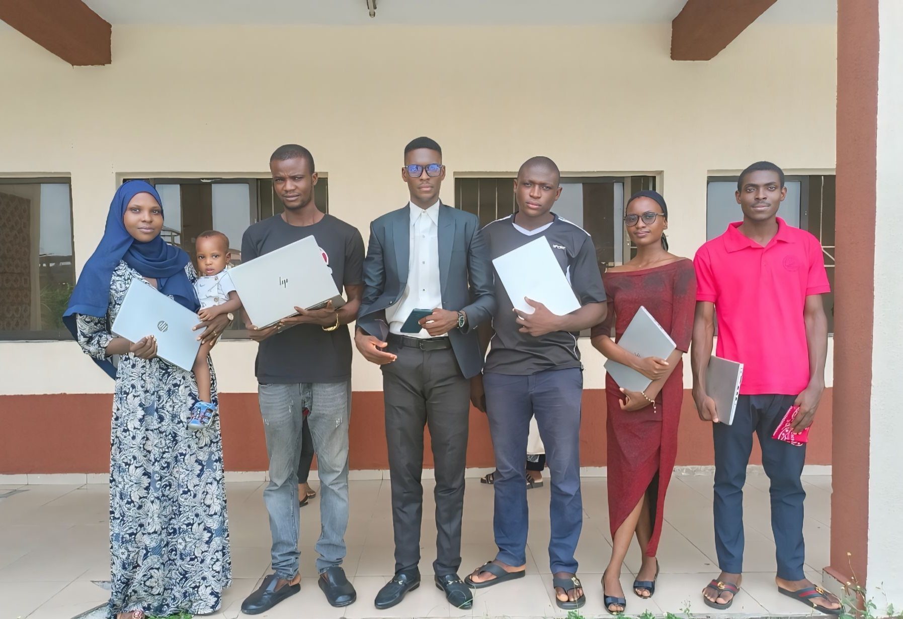
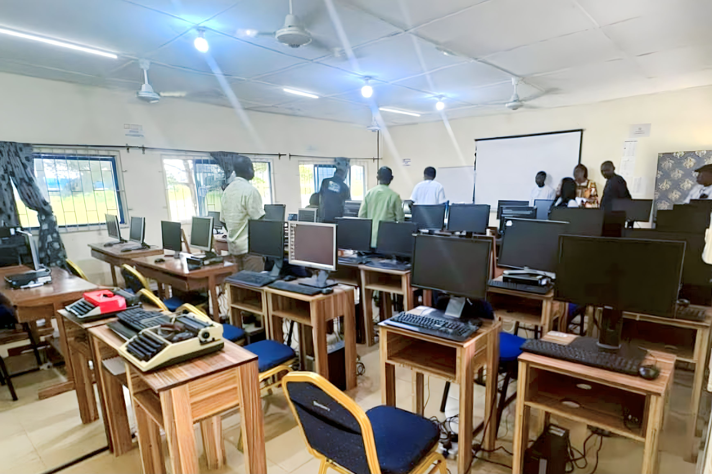
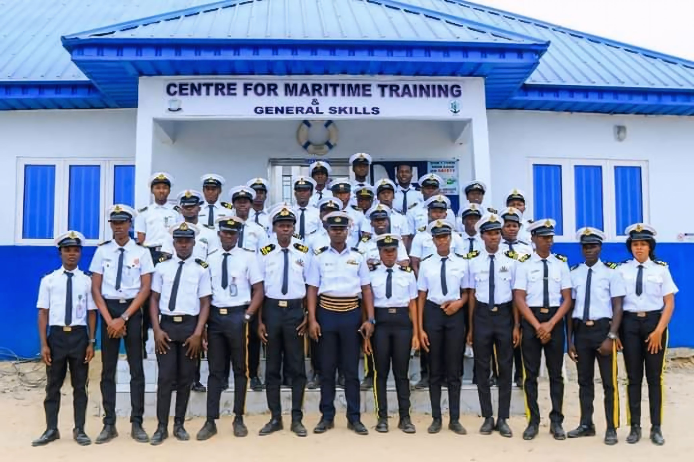

<!-- Cybersecurity Portfolio README -->

  

<h1 align="center">Cybersecurity Portfolio</h1>

  <strong>Cybersecurity Specialist & Educator | IT/OT Critical Infrastructure Security | Cloud & Network Security.</strong>

  
  
  

  

---

<h2 align="center">Building Secure, Resilient Digital Systems</h2>

---

### 🧭 About Me  

**Cybersecurity Specialist** focused on IT/OT security operations, critical infrastructure protection, incident response, and cyber resilience across regulated and safety-critical environments.

Recognised nationally as the **CSEAN Rising Star of the Year 2026** (Cybersecurity Merit Awards) for emerging leadership in cybersecurity, critical infrastructure protection, and workforce development.

**IT/OT Security Operations Officer** at Sinic Engineering Limited, supporting Segilola Resources Operating Limited (SROL) in securing industrial systems, control networks, and enterprise infrastructure within a safety-critical mining environment.

Experience spans **election cybersecurity, critical infrastructure protection, cloud-native security, and AI security**, including secure Agentic AI workflows with AWS Cognito, MCP, and Amazon Bedrock AgentCore.

Trained and mentored **500+ learners** through institutions and national programmes, including the **NITDA 3 Million Technical Talent (3MTT) Programme.**

Contributed to strengthening **OT cybersecurity resilience** through **security monitoring**, **incident response**, **cybersecurity awareness**, and implementing **ISO 27001- and NIST-aligned security controls**.

---

### 🛠️ Skills & Tools

Core capabilities spanning IT/OT security, critical infrastructure protection, monitoring, incident response, and governance frameworks.

#### 🧩 Security & Monitoring

#### 🏭 Industrial Security

#### ☁️ Cloud & Networks

#### 💻 Programming & Scripting

#### 📚 Governance, Risk & Compliance

#### 🎓 Education & Training

---

### 🚀 Featured Projects

### 🔹 [Agentic AI Security at Scale with Strands Agents & Bedrock AgentCore](https://github.com/CliffordEdewor/agentic-ai-security-bedrock-strands)
Production-grade Agentic AI systems secured with AWS Cognito and MCP Gateway, demonstrating end-to-end secure design, deployment, and observability using Strands Agents and Amazon Bedrock AgentCore.

### 🔹 [Secure MCP Agent Integration for AI Tooling](https://github.com/CliffordEdewor/secure-mcp-agent-integration)
Secure agent–tool integration using the Model Context Protocol (MCP) with deployment on AWS AgentCore, demonstrating controlled tool invocation and secure interaction patterns for agentic AI systems.

### 🔹 [Snort IDS Threat Detection](https://github.com/CliffordEdewor/Snort-IDS-Threat-Detection)
Engineered a Snort IDS solution to detect, alert on, and mitigate malicious network activity through custom detection rules and automated monitoring workflows.

### 🔹 [IoT Security: Mitigating Cybersecurity Threats in Connected Devices](https://github.com/CliffordEdewor/IoT-Security-Mitigating-Cybersecurity-Threats-in-Connected-Devices)
Mitigating cybersecurity threats in IoT devices, implementing device-level, network-level, and data security strategies to protect IoT ecosystems.

### 🔹 [Online Voting System](https://github.com/CliffordEdewor/Online-Voting-System)
Secure web-based voting platform demonstrating authentication, election integrity, and trusted digital voting workflows.

### 🔹 [Network Traffic Security Analysis](https://github.com/CliffordEdewor/Network-traffic-security-analysis)
A Cisco Packet Tracer project demonstrating how hubs broadcast all traffic and how switches intelligently forward frames to improve security and prevent sniffing.

---

### 📊 Highlights & Achievements

- Winner, **CSEAN Rising Star of the Year 2026**, presented by the [Cyber Security Experts Association of Nigeria (CSEAN)](https://csean.org.ng), recognising emerging leadership in cybersecurity, workforce development, and critical infrastructure protection.

- Trained and mentored **500+ learners** across **PTI**, **GMA**, and the [National Information Technology Development Agency](https://nitda.gov.ng) **3MTT cybersecurity programme** through practical labs, awareness campaigns, and hands-on defence exercises.

- Served in **Nigeria’s 2023 General Election Cybersecurity Situation Room**, supporting real-time monitoring, incident response coordination, and the protection of critical election technologies.

- **Led the technical preparation and operational readiness** of GMA's Networking & Cloud Computing Laboratory, contributing to [National Board for Technical Education](https://web.nbte.gov.ng/) approval for the **Academy's first HND programmes**.

- Delivered hands-on **cybersecurity training** under **NITDA’s 3MTT Programme**, enabling **~20% of participants** to achieve internationally recognised certifications **(ISC2 CC, CompTIA Security+)**, with others progressing into entry-level roles.

- **Supervised cybersecurity and networking projects** at [Global Maritime Academy](https://gma.edu.ng) (GMA), while leading cybersecurity awareness initiatives that strengthened secure practices among students and staff.

- Served as **Inaugural HND President** of the [Nigeria Association of Computing Students (NACOS)](https://nacos.org.ng/) PTI Chapter, establishing governance structures and leading student-driven initiatives in cybersecurity, and emerging technologies.

---

### 📸 Leadership in Action

**Leadership experience spanning institutional, national, and professional cybersecurity initiatives, driving capacity development and digital resilience.**

#### 🏆 Industry Recognition & Professional Impact

  
 
<em>Recognised by the Cyber Security Experts Association of Nigeria (CSEAN) with the Rising Star of the Year 2026 Award.</em>

 

### 🧠 Cybersecurity Education & National Impact  

  
  
  
<em>Facilitated cybersecurity training under NITDA’s 3MTT Programme. Mentored trainees who earned national recognition, certifications, and laptop awards.</em>  

### 🏫 Institutional Development & Mentorship  

  
  
   
<em>Contributed to practical instruction and mentorship at GMA, guiding learners in cybersecurity, networking, and safety-critical digital systems.</em>

---

### 🏛️ Professional Memberships
- Professional Member, Cyber Security Experts Association of Nigeria (CSEAN)
- Associate Member, Nigeria Computer Society (NCS)

---

### 📫 Connect With Me

---

### 💬 Quote

> 🛡️ *“Protecting critical infrastructure requires secure engineering, resilient systems, and people capable of defending them.”*

---

  <i>© 2026 Clifford Edewor – Building Secure, Resilient Digital Systems</i>

