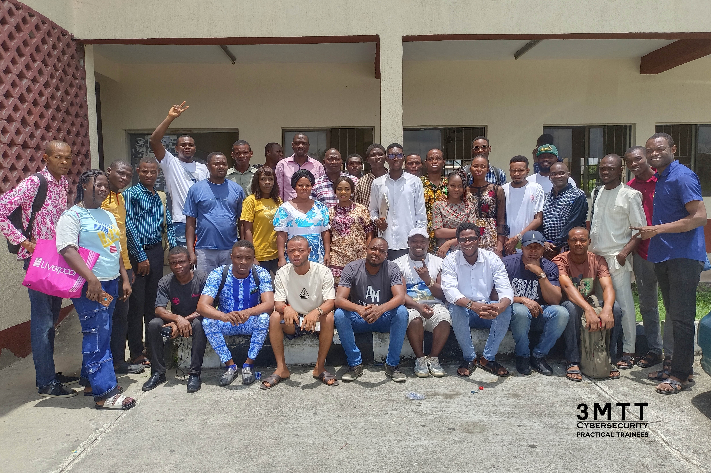

<!-- Cybersecurity Portfolio README -->

  

<h1 align="center">Clifford Edewor | Cybersecurity Portfolio</h1>

  <em>Cybersecurity Specialist & Educator focused on Cloud Security, Network Defense, and Digital Resilience.</em>

  
  
  

---

<h2 align="center">🌍 Inspiring a Safe and Secure Digital World</h2>
<h3 align="center">Building Capacity | Strengthening Systems | Empowering People</h3>

---

### 🧭 About Me  

A **Cybersecurity Specialist and Educator** dedicated to securing systems and empowering people through hands-on training, research, and leadership.  

I have trained and mentored **400+ learners** across institutions and national programmes, including serving as **Cybersecurity Instructor & Facilitator for NITDA’s 3MTT Programme**. My work spans **infrastructure protection, risk management, and digital safety initiatives**, achieving measurable outcomes such as a **40% reduction in cyber risk exposure** among learners and professionals.  

As the **HND Pioneer President of NACOS PTI Chapter**, I strengthened student leadership in **cybersecurity, AI, and cloud computing**, fostering innovation and professional growth.   

I currently serve as an **IT/OT Security Operations Officer** with **Sinic Engineering Limited**, contractor to **Segilola Resources Operating Limited (SROL), a subsidiary of Thor Explorations Ltd**. I oversee control room systems, secure networked security infrastructure, and enforce cybersecurity controls to maintain safe, efficient, and compliant operations in **SROL’s safety-critical mining environment**.

---

### 🛠️ Skills & Tools

#### 🧩 Security & Monitoring

#### ☁️ Cloud & Networks

#### 💻 Programming & Scripting

#### 🧱 Governance, Risk & Compliance

#### 🎓 Education & Training

---

### 📂 Featured Projects

### 🔹 [Snort IDS Threat Detection](https://github.com/CliffordEdewor/Snort-IDS-Threat-Detection)
Real-time threat detection and mitigation using Snort IDS, showcasing intrusion prevention and alerting techniques.  

### 🔹 [IoT Security: Mitigating Cybersecurity Threats in Connected Devices](https://github.com/CliffordEdewor/IoT-Security-Mitigating-Cybersecurity-Threats-in-Connected-Devices)
Mitigating cybersecurity threats in IoT devices, implementing device-level, network-level, and data security strategies to protect IoT ecosystems.

### 🔹 [Online Voting System](https://github.com/CliffordEdewor/Online-Voting-System)
A web-based remote voting platform developed as an ND final-year project to reduce electoral malpractice and enhance trust in online elections.

### 🔹 [Network Traffic Security Analysis](https://github.com/CliffordEdewor/Network-traffic-security-analysis)
A Cisco Packet Tracer project demonstrating how hubs broadcast all traffic and how switches intelligently forward frames to improve security and prevent sniffing.

---

### 📊 Highlights & Achievements

- 🧑‍🏫 Trained and mentored **400+ learners** across **PTI**, **GMA**, and **NITDA’s 3MTT** programmes through immersive labs, awareness campaigns, and practical defense exercises.  

- 🛡️ Contributed to **Nigeria’s 2023 General Elections** as **Cybersecurity Coordinator & Incident Response Team Member**, strengthening electoral security and national resilience.  

- 🎓 Delivered hands-on **cybersecurity training** under **NITDA’s 3MTT Programme**, with **20% of trainees** earning global certifications, awards, and scholarships.  

- 🧠 Supervised **ND2 cybersecurity and networking projects** at **GMA**, fostering innovation, teamwork, and real-world problem-solving.  
  
- 🚀 As a **Cybersecurity Instructor & Networking Lab Technologist**, led **cybersecurity awareness campaigns** that reduced **risk exposure among students and staff by 40%**.

- 🏫 Played a **pivotal role** in securing **NBTE’s approval** for **GMA’s HND Networking & Cloud Computing** programme through the rigorous preparation and defense of the Networking Laboratory.  

- 🧑‍💼 Pioneered **student leadership** as **HND Pioneer President**, driving engagement in **cybersecurity, AI, and cloud computing**; awarded **Excellence for Outstanding Performance as NACOS President (2024 session)**.

---

### 📸 Leadership in Action

**My leadership journey spans institutional, national, and professional levels, shaping talent, innovation, and digital resilience.**

#### 🧑‍💼 Student & Institutional Leadership

  
 
<em>Served as HND Pioneer President, NACOS PTI Chapter, advancing student leadership in computing and cybersecurity.</em>

  

  

### 🧠 Cybersecurity Education & National Impact  

  
  
  
<em>Facilitated cybersecurity training under NITDA’s 3MTT Programme. Mentored trainees who earned national recognition, certifications, and laptop awards.</em>  

### 🏫 Institutional Development & Mentorship  

  
  
   
<em>Contributed to practical instruction and mentorship at GMA, guiding learners in cybersecurity, networking, and safety-critical digital systems.</em>

---

### 🎓 Specialized Training & Certifications

| Certification | Issuer |
|----------------|--------|
| **ISC² Certified in Cybersecurity (CC)**  | ISC² |
| **Applied Live Forensics** | EC-Council |
| **Cybersecurity Leadership & Management**  | ISACA |
| **Senior Management & Information Security Governance**  | ISACA |
| **CS50 Introduction to Cybersecurity** | HarvardX |
| **Advanced Cybersecurity Program** | Stanford University, School of Engineering |

---

### 🏛️ Professional Memberships
- Professional Member, Cyber Security Experts Association of Nigeria (CSEAN)
- Student Member, Nigeria Computer Society (NCS)

---

### 📫 Connect With Me

---

### 💬 Quote

> 🛡️ *“Cybersecurity is not just about technology, it’s about people, trust, and resilience.”*

---

  <i>© 2025 Clifford Edewor – Inspiring a Safe and Secure Digital World</i>

